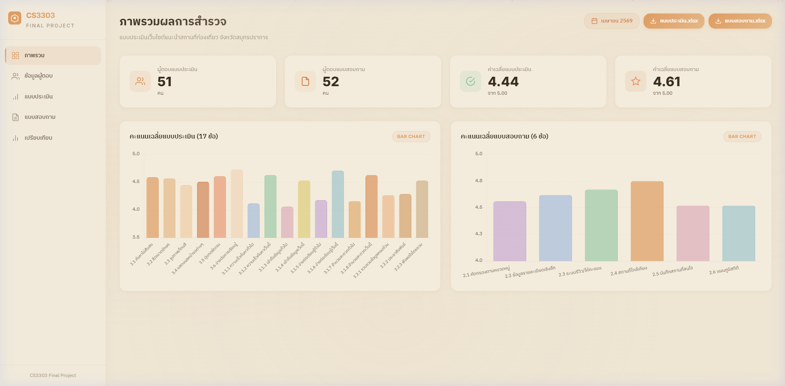
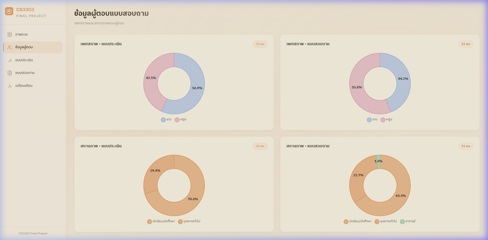
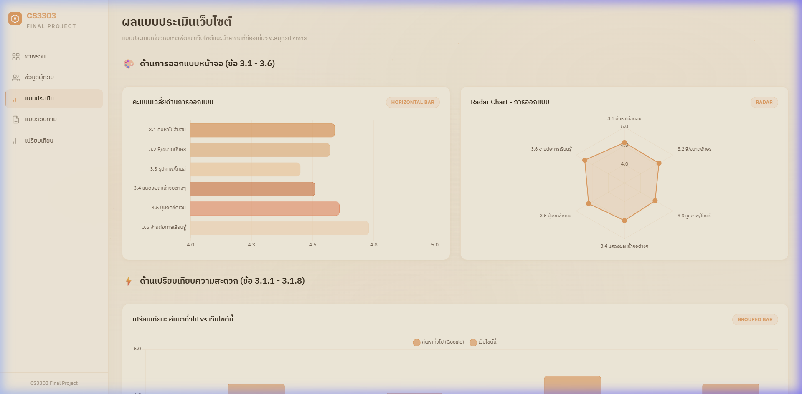
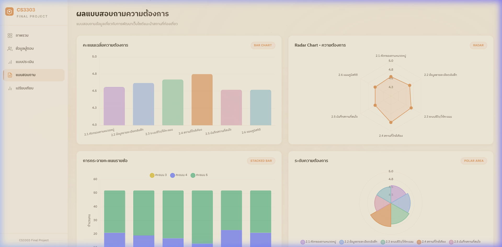
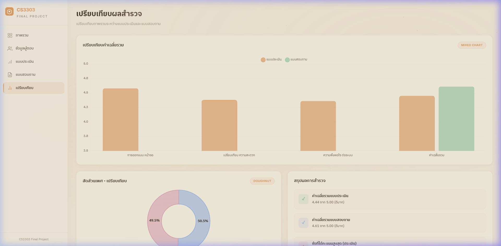

<h1 align="center">
  🍊 CS3303 Final Project — Survey Dashboard
</h1>

<p align="center">
  <strong>📊 แดชบอร์ดแสดงผลการสำรวจเว็บไซต์แนะนำสถานที่ท่องเที่ยว จังหวัดสมุทรปราการ</strong>
</p>

<p align="center">
  
  
  
  
</p>

<p align="center">
  <a href="https://ampsoria.github.io/CS3303_Dashboard/">
    
  </a>
</p>

---

## 📋 เกี่ยวกับโปรเจค

เว็บ Dashboard สำหรับแสดงผลข้อมูลจากแบบสำรวจ 2 ชุด:

| 📝 แบบสำรวจ | 👥 ผู้ตอบ | ❓ จำนวนข้อ | 📌 เนื้อหา |
|---|---|---|---|
| **แบบประเมินเว็บไซต์** | 51 คน | 17 ข้อ | ประเมินการออกแบบ, เปรียบเทียบความสะดวก, ความพึงพอใจ |
| **แบบสอบถามความต้องการ** | 52 คน | 6 ข้อ | สำรวจความต้องการของระบบ (คัดกรอง, รีวิว, บันทึก ฯลฯ) |

---

## 🖼️ ภาพตัวอย่าง

### 🏠 หน้าภาพรวม
> แสดง Stat Cards, คะแนนเฉลี่ย, และ Bar Chart สรุปผลทั้ง 2 แบบสำรวจ



---

### 👥 ข้อมูลผู้ตอบ
> Doughnut Chart แสดงเพศสภาพและสถานภาพ พร้อม % แสดงบนกราฟ



---

### 📊 ผลแบบประเมินเว็บไซต์
> Bar Chart, Radar Chart, Grouped Bar (เปรียบเทียบ Google vs เว็บไซต์), Polar Area, Heatmap Table



---

### 📋 ผลแบบสอบถามความต้องการ
> Bar Chart, Radar Chart, Stacked Bar, Polar Area, Heatmap Table



---

### ⚖️ เปรียบเทียบผลสำรวจ
> เปรียบเทียบค่าเฉลี่ยรวม + สรุปผลการสำรวจ



---

## ✨ ฟีเจอร์หลัก

| ✅ ฟีเจอร์ | 📝 รายละเอียด |
|---|---|
| 🎨 **ธีมสีส้มพาสเทล** | สวยงาม สบายตา พื้นหลังครีมอุ่น |
| 📊 **กราฟหลากชนิด** | Bar, Radar, Doughnut, Polar Area, Stacked Bar, Grouped Bar |
| 🔢 **แสดง % บนกราฟ** | Doughnut chart แสดงเปอร์เซ็นต์โดยไม่ต้อง hover |
| 📥 **ดาวน์โหลด XLSX** | ปุ่มโหลดไฟล์ข้อมูลต้นฉบับ |
| 🎯 **Heatmap Table** | ตารางแจกแจงคะแนนแบบ Heatmap |
| 📱 **Responsive Design** | รองรับทุกขนาดหน้าจอ (Desktop / Tablet / Mobile) |
| ✨ **Micro Animations** | Particle background, Counter animation, Hover effects |
| 🧭 **Sidebar Navigation** | เมนูด้านข้างสำหรับเปลี่ยนหน้า |

---

## 🛠️ เทคโนโลยีที่ใช้

- **HTML5** — โครงสร้างหน้าเว็บ
- **CSS3** — จัดรูปแบบและแอนิเมชัน (Vanilla CSS, Glassmorphism)
- **JavaScript** — ลอจิก, การนำทาง, แอนิเมชันตัวเลข
- **Chart.js 4.4.7** — สร้างกราฟ
- **chartjs-plugin-datalabels** — แสดง % บนกราฟ
- **Google Fonts** — IBM Plex Sans Thai, Inter

---

## 📂 โครงสร้างโปรเจค

```
📦 CS3303_Dashboard
├── 📄 index.html          # หน้าเว็บหลัก
├── 🎨 style.css           # สไตล์ธีมส้มพาสเทล
├── 📊 data.js             # ข้อมูลจากแบบสำรวจ (แปลงจาก XLSX)
├── 📈 charts.js           # สร้างกราฟ Chart.js ทั้งหมด
├── ⚙️ app.js              # Navigation, Particles, Animations
├── 📋 แบบประเมิน...xlsx   # ไฟล์ข้อมูลแบบประเมิน (ต้นฉบับ)
├── 📋 แบบสอบถาม...xlsx    # ไฟล์ข้อมูลแบบสอบถาม (ต้นฉบับ)
├── 📸 screenshots/        # ภาพหน้าจอสำหรับ README
└── 📖 README.md           # ไฟล์นี้
```

---

## 🚀 วิธีรัน

```bash
# Clone โปรเจค
git clone git@github.com:Ampsoria/CS3303_Dashboard.git
cd CS3303_Dashboard

# เปิดด้วย Live Server หรือ Python
python -m http.server 3000

# เปิดเบราว์เซอร์ไปที่
# http://localhost:3000
```

หรือเปิดไฟล์ `index.html` ได้โดยตรงในเบราว์เซอร์ 🌐

---

## 📊 สรุปผลการสำรวจ

| 📌 หัวข้อ | ⭐ ค่าเฉลี่ย | 📝 ระดับ |
|---|---|---|
| 🎨 ด้านการออกแบบหน้าจอ | **4.58** | ดีมาก |
| ⚡ ด้านเปรียบเทียบความสะดวก | **4.38** | ดีมาก |
| ⭐ ด้านความพึงพอใจต่อระบบ | **4.36** | ดีมาก |
| 📊 ค่าเฉลี่ยรวมแบบประเมิน | **4.44** | ดีมาก |
| 📋 ค่าเฉลี่ยรวมแบบสอบถาม | **4.61** | ดีมาก |

> 🏆 ข้อที่ได้คะแนนสูงสุด: **ง่ายต่อการเรียนรู้** (4.73)  
> 📈 เว็บไซต์ได้คะแนนสูงกว่าการค้นหาทั่วไป (Google) ในทุกด้าน

---

<p align="center">
  🧑‍💻 พัฒนาโดย | CS3303 Final Project
</p>

<p align="center">
  <sub>Made with 🍊 and ☕</sub>
</p>
